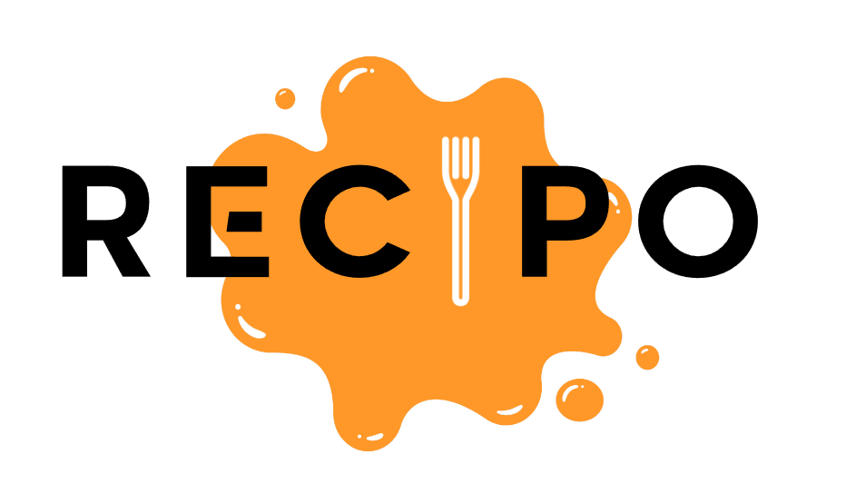

> **ASP.Net based application + ReactJS with styling made with Tailwind CSS**
>
> **Entity Framework with Identity and Microsoft SQL for Data Storage**

# Description

Recipo is website that offers a convenient way for users to search for recipes based on the ingredients they have on hand.

Our user-friendly interface makes it easy to select the ingredients you want to use, and our platform provides a list of delicious recipes that match your selection.

To make the experience even better, we offer a membership program that allows users to add their own recipes to our platform and access exclusive premium recipes.

# Features

> - Create an **Account**.
> - **Premium** Membership.
> - Dashboard has **Categories** listed.
> - Ingredients Page with **filter for ingredient cateogry** and a
>   **search bar**.
> - Recipe List Page with **Free** and **Premium** Recipes.
> - Add Recipes to **Favorites**.
> - View the **Details** of the Recipes on the **Recipe Page**
> - With **Premium**, Add your **Recipe**.
> - User Page with **Favorites Recipes** & **Created Recipes** and user information.
> - From User Page you can **Edit** or **Delete** your recipe.

### Work in Progress Features

> - **User Page**
>   - Change user **_information_**.
>   - Add **Profile Picture**
> - **Add Recipe**
>   - Add images to **_recipes_**.
> - **Recipe Page**
>   - Integrate **_Google Maps_** in Recipe Page
>   - **Find nearest shop or order online** the Ingredients that are **missing** from your selection.
>   - Rating system.
> - **UX**
>   - For **Premium** users, the possibility to make **revenue** from added Recipes by the reviews and recipe completion by other users.
>   - Visit other users' profiles to see their recipes.
>   - Make Favorites List **Private** or **Public**.
>   - Recipes have a **Step by Step** guide where you check the checkbox of each step you completed on the **Recipe Details Page**.

### More features to come from suggestions!

# Technologies used

- **ASP.Net** **_Core_**
- **Entity Framework** & **Identity**
- **Microsoft SQL**
- **ReactJS**
- **Tailwind CSS**
- **Stripe** _( for payment methods )_
- **Google Maps** **_API_** _( work in progress )_

---

# ScreenShots

---
# Help

**If you have any ideas give feedback for future features and other projects.**
